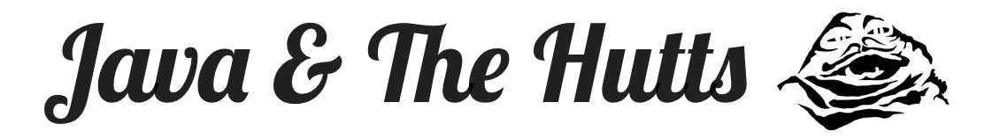

# Team1

Our team name is Java & The Hutts, with Team1 being used for administrative purposes for CSCC01.

## Team Members
* Mohammad Moustafa - 3rd year CS student
* Gabrian Mak - 3rd year CS student
* Brian Liao - 3rd year Stats student
* Anh Le - 2nd year CS student
* Xingyuan Zhu - 3rd year CS student

## Application Stack
Our project will be written in Java. Maven will be used for managing dependencies, and the Swing library will be used for our GUI needs. When creating packages, `jth` (standing for Java & The Hutts) will be used for the organization name.

## Running the project
All that is required for running the project is the appropriate Java version for your machine. All dependencies will be installed via Maven given that a internet connection is available.

1. Clone the project to your local machine
2. Run the project in eclipse using one of the following command line options:
	* -2 to clear all the tables from the database
	* -1 to initialize the database so that the project is ready to be used
	* No command line argument for regular use (after initial database setup)

## Progress
Our team is currently in design and preparation phase of the first sprint
